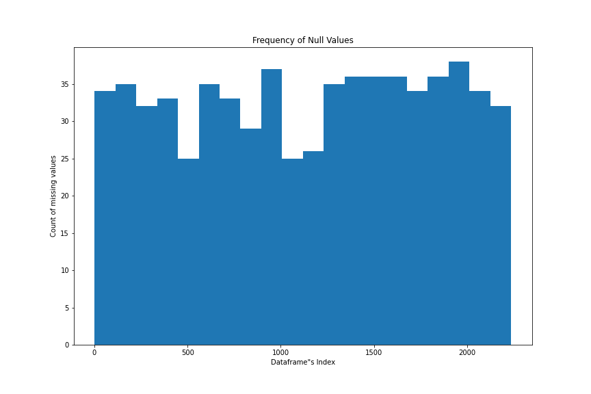
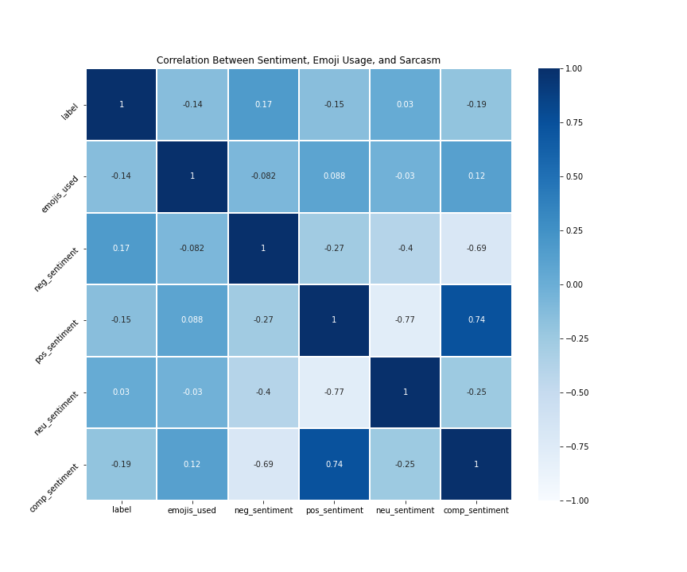
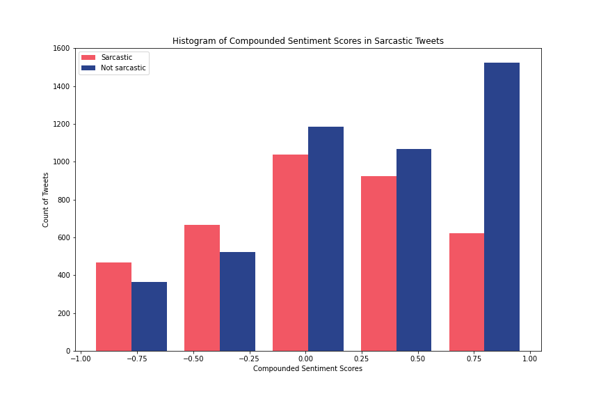

# Sarcasm Detection in Twitter Tweets

---
## Problem Statement

Will machine learning be able to detect sarcasm in Tweets posted on Twitter without the conversation's context?

---
## Background

---
## Table of Contents
1. [Pulling Data](./Code/Pull_tweets.ipynb)
2. [Cleaning and Exploratory Analysis](./Code/Cleaning_and_EDA.ipynb)
3. [Modeling](./Code/Modeling.ipynb)

---
## Datasets and sources
The first dataset was created by Gavin Abercrombie, and pulled from the following [link](https://data.mendeley.com/datasets/fn2mmff85g/1). The tweets in this dataset were received having been manually scored based on the context of the tweet in the string of replies from user 1 to user 2. Only the Author tweets were used in this analysis, and were pulled using Tweepy and the Twitter API. Approximately 600 of the original tweets were no longer available. This dataset accounts for 1580 tweets  or ~20% of the Tweets used in this analysis.

The second dataset from Ghosh, S. included self-labeled tweets labeled with the hashtag "sarcasm" or "sarcastic" and a user tag indicating the tweet belongs to a larger conversation. This dataset comes from the following [repository](https://github.com/EducationalTestingService/sarcasm) and accounts for ~80% of the Tweets used in this analysis.

---
## Data Cleaning and Ingestion

To assemble the dataframe I first needed to pull the Tweet text from Twitter from the Abercrombie (2018) dataset that supplied tweet IDs. Using Tweepy I pulled found the tweets and assembled a dataframe from the json contained in the Tweepy status object json attribute. Several of the tweets contained return characters that contributed to formatting problems when further processing a saved csv of the tweets, so I replaced them with another character that would ensure the subsequent csv would not be misread due to the return characters.
Additionally, about 660 tweets from the original list of Tweets were no longer available, but they did not impact the positive and negative class ratios when dropped from the dataset. The missing tweets were equally distributed throughout the dataset as seen in the histogram below, and were unable to be pulled directly from the Twitter API as well. Likely, those tweets have since been deleted from the platform.

The second dataset used from Ghosh (2020) contained 5000 Tweet texts with user handles replaced by '@USER'. Tweets were self-labeled as Sarcastic, or not Sarcastic, determined by the hashtag #Sarcasm, or #Sarcastic. I used just the responses column from this dataset, which is the final response to the context contained in the rest of the Tweet conversations.

The two datasets were merged to form a dataset with 8380 Tweets  that were scored either 1- Sarcastic, or 2- Not Sarcastic.

---
## Key Features

|Feature|Type|Origin Dataset|Description|
|---|---|---|---|

---
## Exploratory Data analysis
From personal experience I felt that both sentiment and emoji usage may be features that correlate highly with sarcasm. To explore the impact of Emoji usage on the target column I created a list of every unique emoji present in the database, there were 336 emojis used in the text corpus and 2500 instances of emoji usage. 87% of the corpus did not include any emojis, and only 8% of the sarcastic tweets used emojis. When evaluated the correlation between number of emojis included in a tweet and the target column of sarcasm was only -.134.

Sentiment analysis is often brought in as a counter example for why sarcasm detection can be difficult in Natural Language Processing. Although this analysis will not focus on incorporating sentiment analysis techniques to make predictions, I was interested in performing a sentiment analysis on the data. I used the sentiment analyzer in NLTK's Vader package to score each tweet's sentiment.

In the heatmap above we can see that the sentiment scores and sarcasm have weak relationships ranging from -0.19 (Compounded Sentiment Score) to 0.17 (Negative Sentiment Score). Further investigation indicates that 70% of the dataset scored positively when the sentiment score was compounded. In the histogram below are two series, indicating the Sarcasm/No Sarcasm label, you can see that the sarcastic tweets form a more normal distribution than the not sarcastic tweets which skewed positive.

 Riloff, R. (2013)

---
## Modeling

---
## Conclusions and Recommendations

---
## Sources

Riloff, R. (2013). Sarcasm as Contrast between a Positive Sentiment and Negative Situation. In Proceedings of the 2013 Conference on Empirical Methods in Natural Language Processing (pp. 704–714). Association for Computational Linguistics.

Abercrombie, Gavin (2018), “Corpus of Sarcasm in Twitter Conversations”, Mendeley Data, V1, doi: 10.17632/fn2mmff85g.1

Ghosh, S. (2020). A Report on the 2020 Sarcasm Detection Shared Task. In Proceedings of the Second Workshop on Figurative Language Processing (pp. 1–11). Association for Computational Linguistics.

Numpy, Pandas, Matplotlib Scikit-learn, Seaborn, Tensorflow
